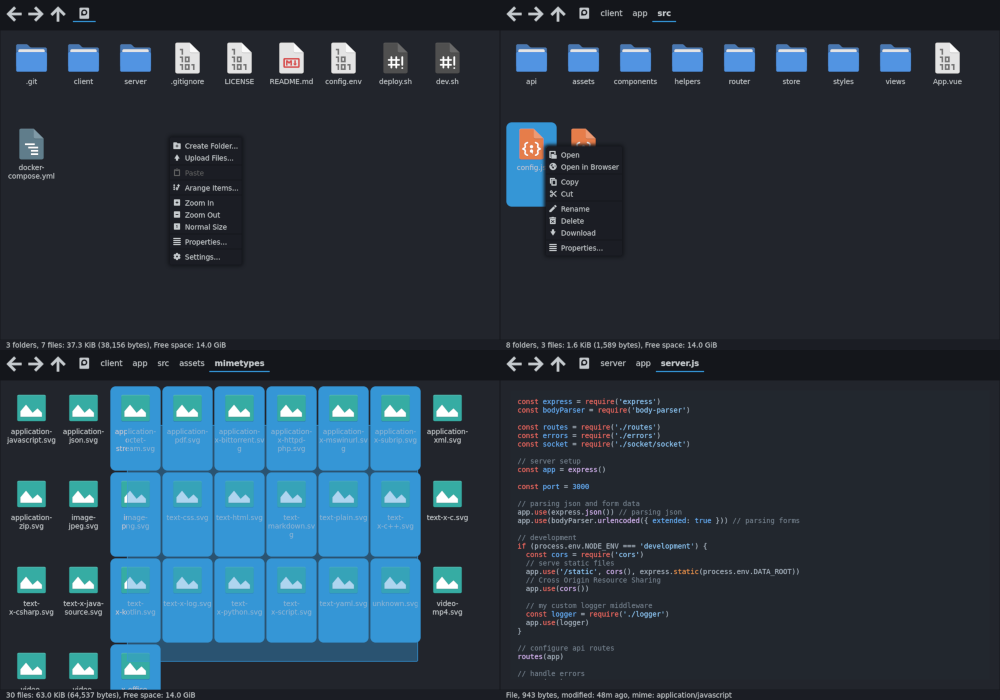

# Cloudv3

Web file manager which supports opening files

Inspired by [Thunar File Manager](https://docs.xfce.org/xfce/thunar/start), [Matcha Gtk Theme](https://github.com/vinceliuice/Matcha-gtk-theme) and [Papirus Icons](https://github.com/PapirusDevelopmentTeam/papirus-icon-theme)

## Installation

- docker-compose is required
- `git clone https://github.com/caydey/cloudv3`
- `cd cloudv3/`
- `vim config.env`
- `./deploy.sh`
